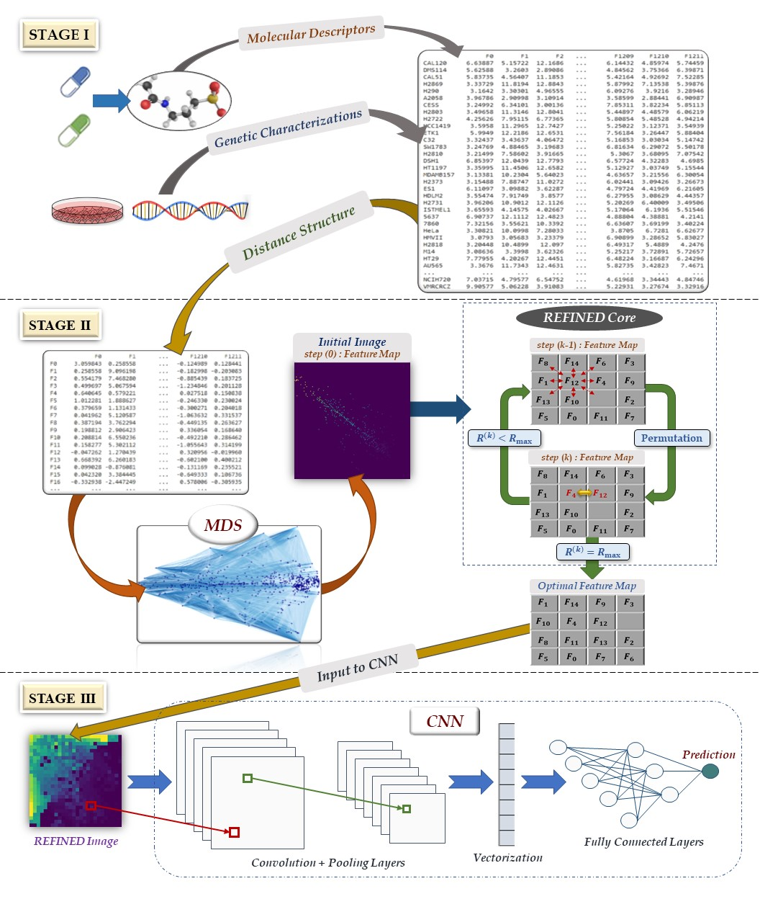

# REFINED

This repository is made to share the [REFINED](https://www.nature.com/articles/s41467-020-18197-y) (Representation of Features as Images with NEighborhood Dependencies). To use the REFINED and create images corresponding to your dataset you need to use the following codes step by step. REFINED contains two main cores, initial MDS and hill climbing, where both are eucliadean distance based. First the initiall coordinates will be created by MDS initializer part, then the coordinates will be updated by the hill climbing. Multiple functions are being used in the process, hence a Toolpox.py is provided which includes all the function needed. 
**We added small subset of processed NCI60 data in the data folder for the users to be able to use the code. Note that due to the size of the dataset, the performance is much lower than the paper.**

### Reuqired python packages
To use all the provided code, installing following packages is required. All the packages can be installed using the `pip install --package name`. Installing all the packages takes less than 5 minutes.
1. Numpy
2. Pandas
3. Scipy
4. Scikit-learn
5. Tensorflow
6. Keras
7. MPI
8. Matplotlib
9. Pickle
10. Math

## 1. Initial MDS
The **Initial_MDS.py** provides the none-overlaping coordinates generated by post MDS processing, plus euclidean distance matrix and feature lists (descriptor names) as input of the hill climbing. Note that the provided coordinates also can be used to generate image to train a CNN. The initial MDS uses some of the toolbox functions integrated with the following steps:

- Loading the data
This section loads the input data, no anottation is needed (unsupervised). The **"normalized_padel_feats_NCI60_672_small.csv"** is provided to test the code.

- MDS
This part of the code applies MDS and its post processing steps for transposed dimensionality reduction and creating inital image coordinates.

- Saving hill climbing inputs
As the hill climbing algorithms works based on minimizing the Euclidean distance, beside the the MDS image coordinates, a euclidean distance of features as matrice need to saved as inputs of the hill climbing. Therefore all the hill climbing required inputs are saved as a pickle.

## 2. Hill climbing
The hill climbing section of REFINED is written based on using Message Passing Interface (MPI) of python to use HPCC resource very efficiently. To run this code make sure to install **mpi4py** library of Python. The hill climbing algorithm section was written based master-slave control process where the first processor is the master and other processors will slave. The master processor distribute, scatter and receive data from slave processors. Slave processors do the computational task. Some computational functions needed to run Hill climbing code should be imported from **paraHill.py**
To run the hill climbing algorithm one need to use the **mpiHill_UF.py**. 

- Input:
Input of hill climbing is the initial MDS output saved as pickle file. It includes three parameter;  **`gene_names`**: feature names, **`dist_matr`**: Euclidean distance matrix of features in initial space, **`init_map`**: feature's coordinate created by initial MDS.

- Parameters:
The only parameter that user of this algorithm need to choose is number of iterations. Number of iterations is basically how many times the hill climbing goes over the entire features and check each feature exchange cost. Defaults is NI = 5.

- Output:
The feature names, REFINED coordinates, and intial map will be save as the output of hill climbing in a pickle file. REFINED are coordinates are saved in **`coords`**.

- Example:
The below bash script can be used as an example for running the **mpiHill_UF.py**.
` mpirun -np $NSLOTS python3 mpiHill_UF.py --init 'Init.pickle'	--mapping 'Mapping.pickle'  --evolution "Evolv.csv" --num 5`

#### Please note that, it is recommended to use the REFINED code on HPCC as it is a time-consuming process. For the NCI60 dataset, if your PC has sufficient memory, it takes more than 12 hourse to run. But, as it is recommended, if you use a HPC system, it takes less than an hour. 

## 3. Training a CNN
After features coordinates are found by REFINED, they can be used to convert data into images, then trai a CNN. To this end we provided a small subset of the NCI60 dataset drug descriptors and responses in the `data` folder, and the architectures that we used to train for NCI regression and classification tasks of the paper in the `train` folder. The code that we used to train the REFINED CNN model on the GDSC dataset is also provided under the `train` folder as **GDSC_train.py**.

## 4. Data
**`NCI60`**: We downloaded the GI50 data from [NCI60_download](https://dtp.cancer.gov/databases_tools/bulk_data.htm) and the associated drug's chemical information from [Pubchem](https://pubchem.ncbi.nlm.nih.gov/).

**`GDSC`**: We downloaded the IC50 responses and cell line screened data from [GDSC_download](https://www.cancerrxgene.org/downloads/bulk_download), and the drug's chemical information from [Pubchem](https://pubchem.ncbi.nlm.nih.gov/).

**`PaDel`**: To convert the chemical information of each drug to their descriptors, we used [PaDel](http://www.yapcwsoft.com/dd/padeldescriptor/) software.
## 5. Syntethic data
The code for generating the synthetic data and modeling with the CNN model are provided in the `Syntethic data` folder. Please note that, after generating the data using **Synthetic_Data.py** one need to generated coordinates using the REFINED algorithm, then use the **Synthetic_CNN.py** for modeling.

## 6. Visualization with REFINED
**REFINED_Viz.ipynb** is also provided to show how REFINED can be used to represent a datapoint (sample) in a dataset as an image.

## Cite
If you use [REFINED](https://www.nature.com/articles/s41467-020-18197-y) for research, please cite the following paper:

> Bazgir, Omid, Ruibo Zhang, Saugato Rahman Dhruba, Raziur Rahman, Souparno Ghosh, and Ranadip Pal. "Representation of features as images with neighborhood dependencies for compatibility with convolutional neural networks." Nature Communications 11, no. 1 (2020): 1-13.

